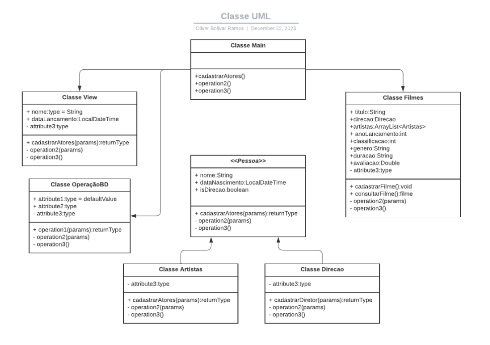
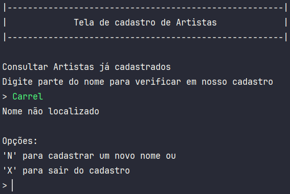
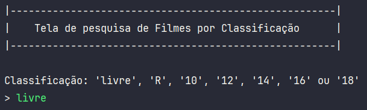
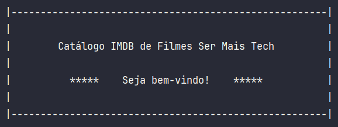
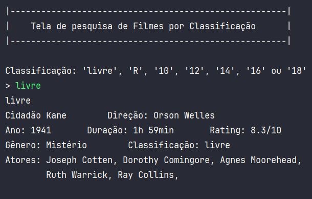
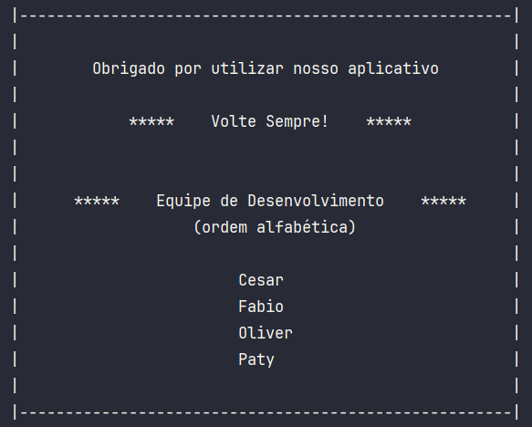
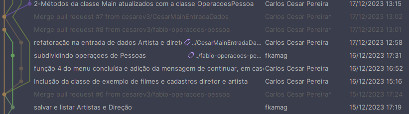

# Projeto Catalogo Filmes | IMDB

Projeto de conclusão de módulo de Programação Orientada a Objeto - POO, 
do curso da Ser Mais Tech 50+ ADA e Núclea.

Integrantes em ordem alfabética:

    - Cesar - @Cesarev3
    - Fábio - @fkamag
    - Oliver - @OliRamos
    - Patricia - @Patycrazier

### Aqui abaixo as requisitos do projeto:

*Desenvolva um sistema que apresente um catálogo de filmes, similar ao IMDB.*

*Neste sistema cada filme deve possuir alguns atributos como o nome, data de*
*lançamento, orçamento e descrição.*

*Cada filme também deve possuir um diretor e uma lista de atores que trabalharam no filme, adicione atributos para as pessoas.* 
*Implemente uma aplicação em que o usuário possa:*

- *cadastrar filmes*
- *cadastrar atores*
- *cadastrar diretores*
- *associar um filme com seus atores e diretores*
- *permita pesquisar filme cadastrados pelo nome, desconsiderando letras maiúsculas e minúsculas*

## Desenhando a solução

Começamos debatendo qual seria a estrutura de classes, qual seria a classe pai, quais atributos seriam herdados, quais
seriam protegidos e que nomes usaríamos nas classes.

Fizemos uma lista, no bloco de notas mesmo e, à partir dela, resolvemos usar o LucidChart para trazer
um pouco de UML ao projeto, ressalto que trata-se de um rascunho inacabado.

Aqui um pouco do nosso processo de aprendizado.

    

## Codificando

Depois das ideias estarem 'em ordem', é o que acreditávamos... iniciamos
a codificação e no caminho encontramos oportunidades de desenvolver algumas funcionalidades
e implementá-las.

 - Inserimos uma opção de busca por String antes de cadastrar um artista, direção ou filme.

    

 - Também implementamos a busca de filmes por classificação etária:

    

Depois de muitas reuniões e trabalho, o projeto estava pronto para entrega.

## Algumas telas:

- Tela de boas-vindas:

    

- Tela de opções principais:

    

- Tela de pesquisa por classificação, um diferencial que foi criado:

    

- E entre tantas outras a de agradecimento!

    

 

## Conclusões e aprendizados

Projeto totalmente desenvolvido utilizando a linguagem Java. Tivemos oportunidade
de gravar e realmente aplicar alguns conceitos de POO, como herança, por exemplo.

Além disso, pudemos abrir as portas para o uso mais intenso do Git e entendimento
muito melhor sobre controle de versões, mais um registo abaixo:

    

Agora aguardamos que venham os próximos!
